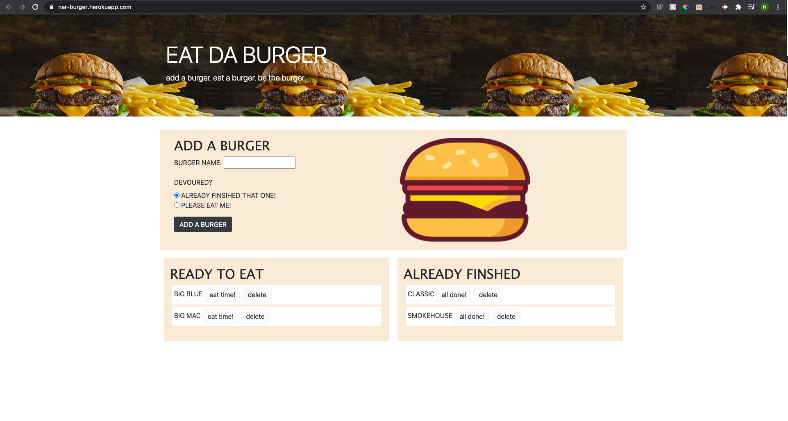
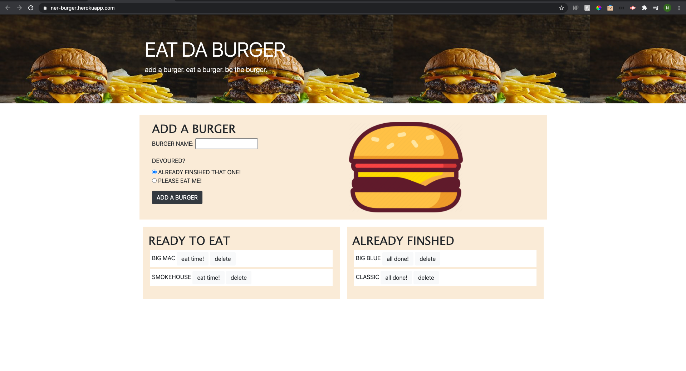

# burger_restaurant
burger restaurant using express mysql express handlebars 

### Description
This application creates a burger logger using MySQL, Node, Express, Express Handlebars, ORM, and an MVC design pattern. You can create a burger, decided if you want to eat it right away or wait, and then once it is logged you can choose to eat it, recreate it, or delete it. This application has full CRUD functionality. 

This application is deployed to Heroku.

    
## Table of Contents
1. [Installation](#installation)
2. [Usage](#usage)
3. [License](#license)
4. [Contributing](#contributing)
5. [Tests](#tests)
6. [Questions](#questions)

### Images of Employee Profile Process

### Step 1

### Step 2

### Step 3

### Step 4

### Step 5

### Installation
In terminal, please make sure to npm init -y and npm i express, express-handlebars, and mysql, then require the package in your js file. Also, please update the "password" on line 27 of the index.js file to your MySQL password. 

### Usage
This application can be used to manage burger types and CRUD functionality. 

### License 

This application is covered under MIT.

### Contributing 
Pull requests are welcome. For major changes, please open an issue first to discuss what you would like to change.

### Tests
Please make sure to update tests as appropriate.

### Questions
1. [Github](https://github.com/nicoleremy95)

### Link to Deployed Application
1. [EAT DA BURGER](https://ner-burger.herokuapp.com/)
    
     